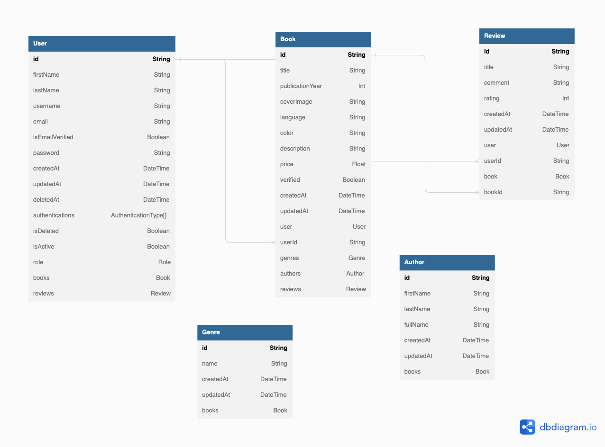

<p align="center">
 
</p>


### Stack


### Features

- [x] Authentication
- [x] Authorization
- [x] User management
- [x] Role management
- [x] Permission management


## Description

BookStore is a application that allows you to manage books and authors. It is a backend application written in TypeScript using the NestJS framework.
The application is also equipped with a Dockerfile that allows you to run the application in a Docker container.

## Requirements

- [Node.js](https://nodejs.org/en/)
- [pnpm](https://pnpm.io/)
- [PostgreSQL](https://www.postgresql.org/)
- [Docker](https://www.docker.com/)


## Installation

```bash
$ pnpm install
```

## Running the app

```bash
# development
$ pnpm run start

# watch mode
$ pnpm run start:dev

# production mode
$ pnpm run start:prod
```

## Docker

You can build the docker image by running the following command:

```bash
$ docker build -t bookstore .
```

And then you can run the docker image by running the following command:

```bash
$ docker run -p 3000:3000 bookstore
```

## Prisma

To generate prisma client run the following command:

```bash
$ pnpm run prisma:generate
```
## Swagger

You can access the swagger API documentation by accessing the following address:

```bash
http://localhost:3000/api
```

## SEEDS

To run seeds run the following command:

```bash
$ pnpm run seed
```

## Model diagram

<p align="center">
 
</p>

